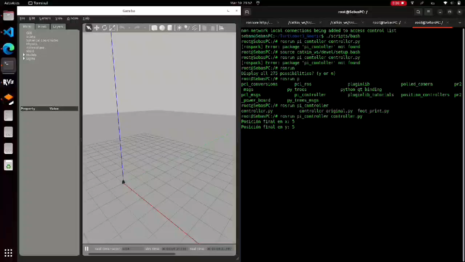

# Sebastian Palacio Betancur - Projects Portfolio

## About Me
I'm Sebastian Palacio Betancur, a passionate engineer specializing in **Robotics**, **AI** and **Data Science**. I have experience working on a wide range of projects from object detection using deep learning models to designing autonomous robotic systems. I strive to solve real-world problems with innovative technology.

### Contact Information
- **LinkedIn**: [LinkedIn Profile](https://linkedin.com/in/sebastianpalaciobetancur)
- **GitHub**: [GitHub Profile](https://github.com/spalaciobe)
- **Email**: [sebaspalacio02@gmail.com](mailto:sebaspalacio02@gmail.com)

## Featured Projects

### 1. PID Control of Differential Drive Robot with ROS
**Objective**: verbos.

- **Technologies**: Python, ROS.
- **Description**: Explanation of the system, design, and key challenges faced.
- **Outcome**: Results achieved or the impact of the project.
- [View Code](https://github.com/spalaciobe/PID_Control_DDR_ROS.git) \
  

### 2. YOLOv9 models for leaf disease detection
**Objective**: Brief description of the problem and goal.

- **Technologies**: Python, YOLO.
- **Description**: Explanation of the system, design, and key challenges faced.
- **Outcome**: Results achieved or the impact of the project.
- [View Code](https://github.com/spalaciobe/YOLOv9_Leaf_disease_detection.git) \
  

### 3. Control of Rotary Inverted Pendulum (Furuta Pendulum) using Arduino
**Objective**: Brief description of the problem and goal.

- **Technologies**: Python, TensorFlow, ROS, RPi, etc.
- **Description**: Explanation of the system, design, and key challenges faced.
- **Outcome**: Results achieved or the impact of the project.
- [View Code](https://github.com/your-repo)
- 

### 4. Serial Communication-Based Motor Control Using PIC16F877A
**Objective**: Brief description of the problem and goal.

- **Technologies**: Python, TensorFlow, ROS, RPi, etc.
- **Description**: Explanation of the system, design, and key challenges faced.
- **Outcome**: Results achieved or the impact of the project.
- [View Code](https://github.com/your-repo)
- 

