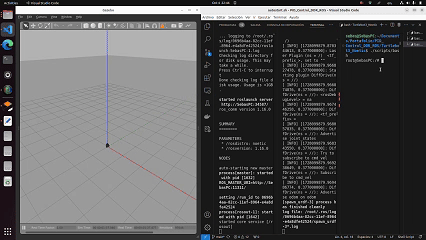
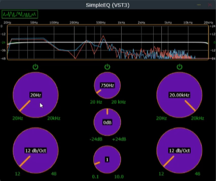
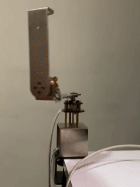

<meta property="og:image" content="images/Preview.png" />

## About Me
I'm a passionate engineer specializing in **Robotics**, **AI** and **Data Science**. I have experience working on a wide range of projects from object detection using deep learning models to designing autonomous robotic systems. I strive to solve real-world problems with innovative technology.

### Contact Information
- **LinkedIn**: [LinkedIn Profile](https://linkedin.com/in/sebastianpalaciobetancur)
- **GitHub**: [GitHub Profile](https://github.com/spalaciobe)
- **Email**: [sebaspalacio02@gmail.com](mailto:sebaspalacio02@gmail.com)

## Featured Projects

### 1. PID Control of Differential Drive Robot with ROS
This project involves developing a PID controller for autonomous TurtleBot3 navigation using ROS within a Docker environment. It showcases the robot's ability to navigate to designated coordinates while ensuring precise movement control. 
- For more information, see the [GitHub Repository](https://github.com/spalaciobe/PID_Control_DDR_ROS.git) \
  
---

### 2. YOLOv9 models for leaf disease detection
This project utilizes YOLOv9 models to accurately detect and classify leaf diseases in plants. It encompasses custom training, transformation of the PlantVillage dataset into an object detection format, and evaluation of model performance, achieving high precision and recall. 
- For more information, see the [GitHub Repository](https://github.com/spalaciobe/YOLOv9_Leaf_disease_detection.git) \
  
---

### 3. 3-Band Equalizer Plugin (C++ & JUCE Framework)
 This project is a 3-band equalizer plugin built with modern C++ and the JUCE framework, featuring real-time audio spectrum analysis. It allows users to adjust low, mid, and high frequencies with a user-friendly interface for precise sound control.

- For more information, see the [GitHub Repository](https://github.com/spalaciobe/Audio_Plugin_Cpp.git) \
  

---

### 4. Control of Rotary Inverted Pendulum (Furuta Pendulum) using Arduino
This project implements a control system for a Rotary Inverted Pendulum using Arduino, focusing on advanced LQR and PD control algorithms. The system is supported by mathematical modeling and simulation, ensuring effective stabilization and performance in real-time applications.
- For more information, see the [GitHub Repository](https://github.com/spalaciobe/Furuta_Pendulum_Arduino.git) \
  

---
### 5. Serial Communication-Based Motor Control Using PIC16F877A
 This project showcases the control of a DC motor using a PIC microcontroller via serial communication. Designed in Proteus, it features real-time simulation of motor behavior, fault detection, and adjustment of speed and direction through user commands.

- For more information, see the [GitHub Repository](https://github.com/spalaciobe/Serial_Motor_Control_PIC.git) \
  

